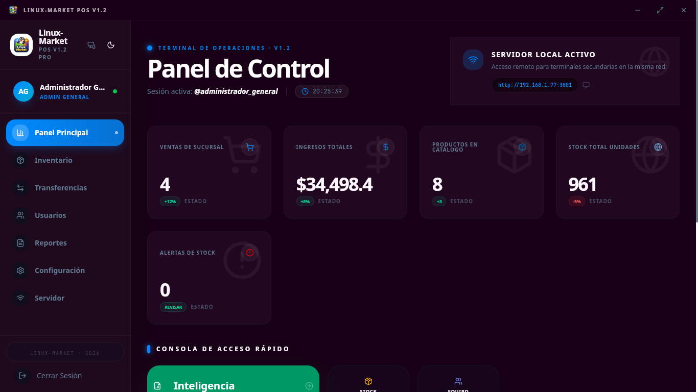
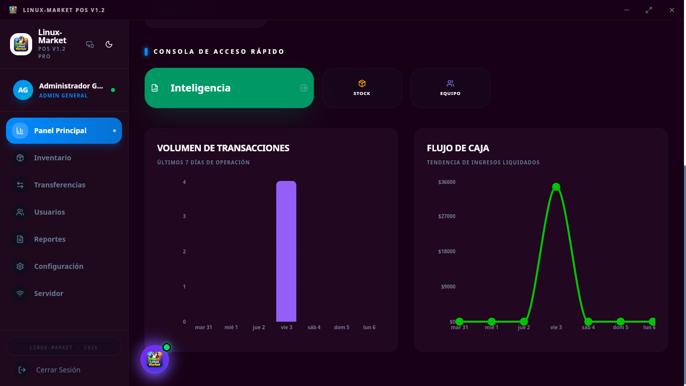
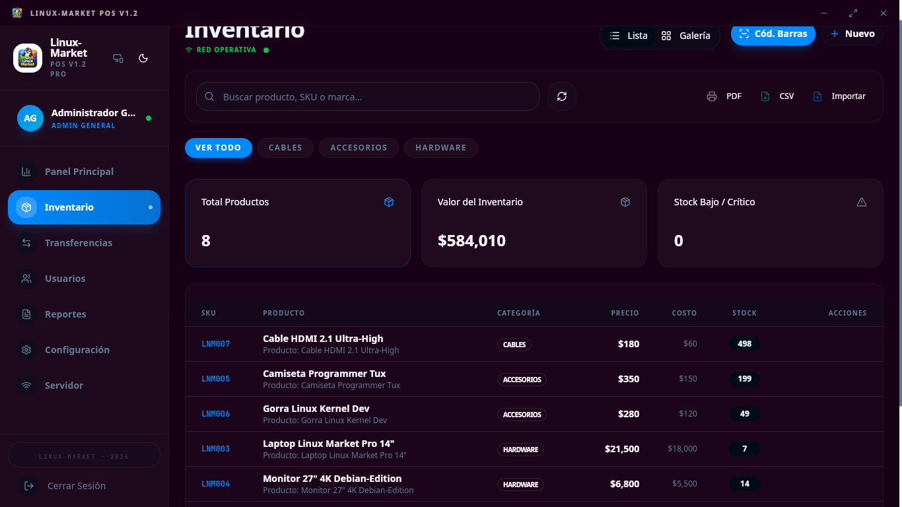
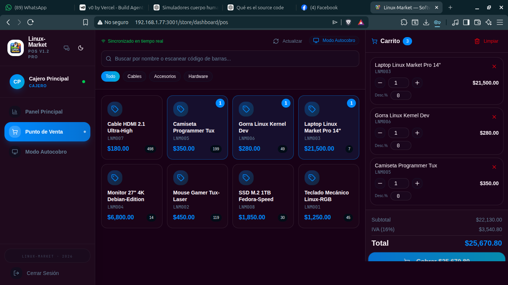

# 🚀 Linux-Market POS
**El ecosistema de Punto de Venta definitivo para la comunidad Linux.**

[](LICENSE)
[]()
[]()

Linux-Market POS es un sistema de Punto de Venta (POS) moderno, de alto rendimiento y código abierto, diseñado para transformar la gestión comercial en entornos Linux. Construido sobre **Rust (Tauri)** y **Next.js**, ofrece una experiencia de usuario fluida, segura y visualmente impactante ("Cyber-Dark").

---

## 📸 Galería del Sistema

<div align="center">
  <table>
    <tr>
      <td width="50%">
        
        <p align="center"><b>Dashboard de Inteligencia de Negocios</b></p>
      </td>
      <td width="50%">
        
        <p align="center"><b>Punto de Venta (POS) de Alta Velocidad</b></p>
      </td>
    </tr>
    <tr>
      <td width="50%">
        
        <p align="center"><b>Gestión de Inventario y Almacenes</b></p>
      </td>
      <td width="50%">
        
        <p align="center"><b>Consola Maestra de Administración</b></p>
      </td>
    </tr>
  </table>
</div>

---

## ✨ Características Principales

*   🛡️ **Multi-Rol Jerárquico**: 4 niveles de acceso (Cajero, Almacenista, Admin Sucursal, Admin General).
*   🛒 **POS Híbrido**: Interfaz optimizada para pantallas táctiles y teclado/mouse.
*   🦾 **Modo Kiosco**: Sistema de auto-cobro con cierre de sesión automático e interfaz simplificada.
*   📦 **Logística Inteligente**: Control de stock, SKUs, códigos de barras y alertas de suministro crítico.
*   📊 **Analítica en Tiempo Real**: Dashboards visuales para ventas, flujo de caja y tendencias.
*   🌐 **Sincronización LAN**: Servidor local integrado que permite conectar múltiples terminales en la misma red sin internet.
*   🖨️ **Integración de Periféricos**: Soporte nativo para impresoras térmicas (ESC/POS) y escáneres industriales.
*   🔐 **Seguridad Bancaria**: Encriptación de datos sensible y sistema de auditoría completa.

---

## 🛠️ Stack Tecnológico

*   **Núcleo**: Rust (via Tauri v2)
*   **Frontend**: Next.js 16 (React 19)
*   **Estilos**: Tailwind CSS v4 (Cyber-Dark Aesthetic)
*   **Base de Datos**: SQLite (Persistence) + Dexie.js (IndexedDB Cache)
*   **Gráficas**: Recharts (High Precision Charts)
*   **Comunicación**: SSE para sincronización en tiempo real.

---

## 🐧 Instalación Rápida

Linux-Market POS está optimizado para las principales distribuciones Linux.

### Usuarios Debian / Ubuntu / Mint
```bash
sudo bash scripts/install-debian.sh
pnpm install && pnpm desktop
```

### Usuarios Fedora / RHEL
```bash
sudo bash scripts/install-fedora.sh
pnpm install && pnpm desktop
```

### Usuarios Arch Linux / Manjaro
```bash
sudo bash scripts/install-arch.sh
pnpm install && pnpm desktop
```

> [!TIP]
> Para guías detalladas sobre Windows o despliegue en servidor Web, consulta la [Guía de Instalación completa](INSTALACION.md).

---

## 🤝 Contribuciones

Este es un proyecto de la comunidad para la comunidad. Si quieres mejorar el código, proponer funcionalidades o reportar errores, revisa nuestra [Guía de Contribución](CONTRIBUTING.md).

---

## 📄 Licencia

Este proyecto está bajo la Licencia **MIT**. Eres libre de usarlo, modificarlo y distribuirlo para fines personales o comerciales.

---

**Linux-Market POS** - *Tecnología libre y moderna para potenciar tu negocio.*  
Desarrollado con pasión por **Alexis Gabriel Lugo Villeda**.
